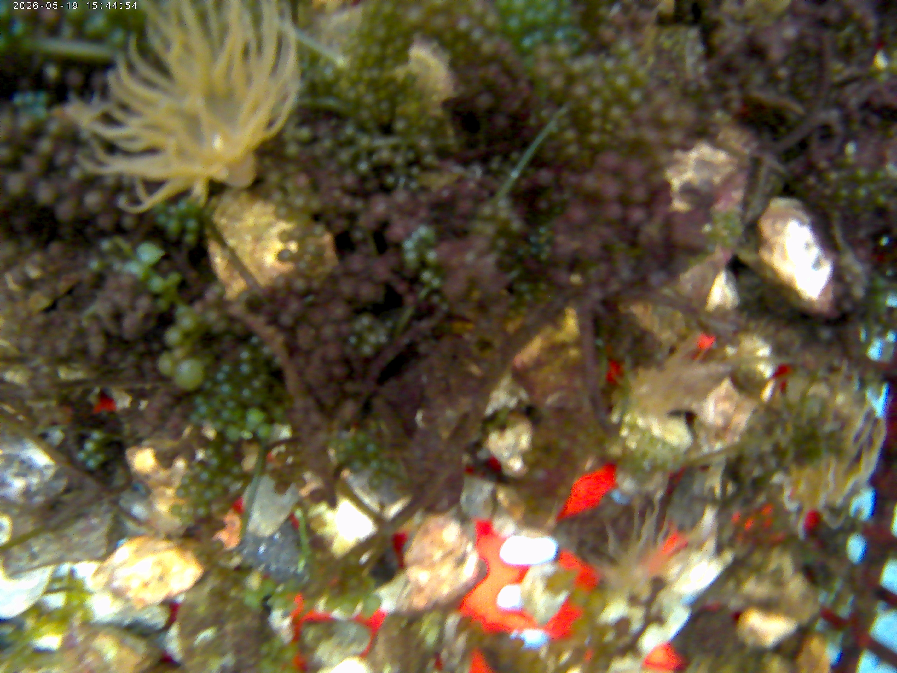
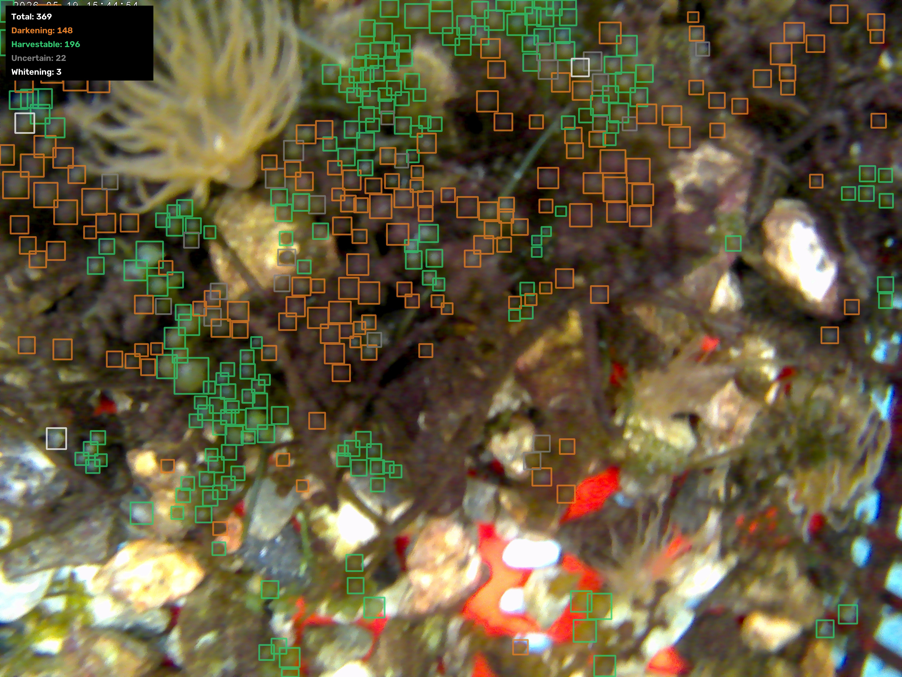
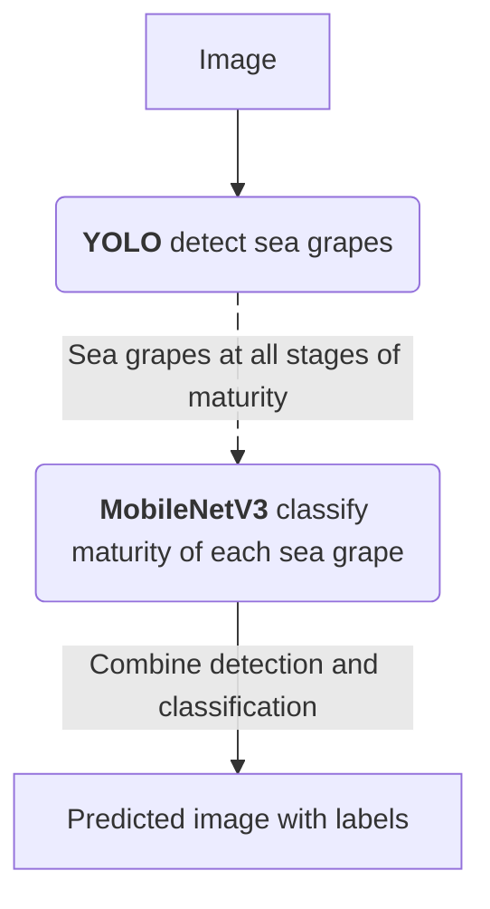
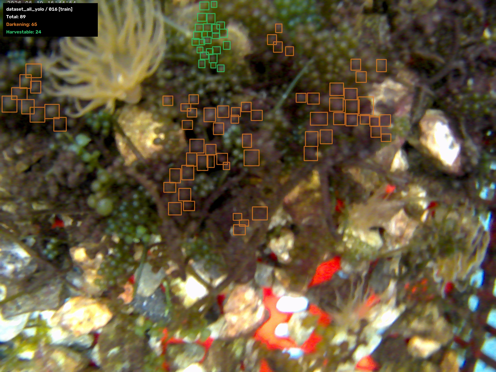

# Sea Grape Maturity Detection

### Example

Original Image             |  Model Detection
:-------------------------:|:-------------------------:
  |  

## Workflow

## 1. Data Preparation

The original dataset is missing many sea grape labels, which can confuse the model into treating real sea grapes as background.

To address this, I trained a model on the original dataset and used it to pre-label the missing sea grapes, then manually reviewed and refined all annotations.

Original Data             |  Updated Data
:-------------------------:|:-------------------------:
  |  

## 2. Data Processing

> [pipeline/01_slice_tiles.py](pipeline/01_slice_tiles.py)

**Problem**: 
- The dataset contains 4650x3480 images, which are quite big but blurry. 
- Resizing them directly to YOLO's standard 640x640 input would shrink each grape (~80x79 px) down to roughly 11 px, making harder to detect.

**Solve**: Each image is sliced into 640x640 tiles, matching YOLO's standard input size while preserving the grape's real pixel size.

## 3. 