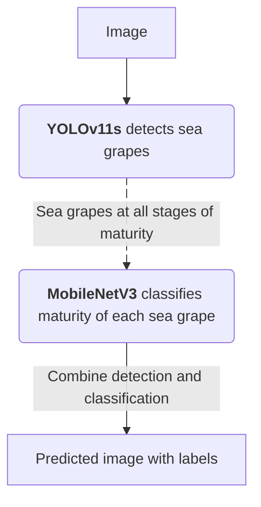

# Sea Grape Maturity Detection

### Example

Image             |  Model Detection
:-------------------------:|:-------------------------:
  |  

## Navigation
- [Project Workflow](#project-workflow)
- [Development](#development)
    - [1. Prepare Data](#1-prepare_data)
    - [2. Process Data](#2-process-data)
    - [3. Build Dataset for Classifier](#3-build-dataset-for-classifier)

## Project Workflow

## Development

### 1. Prepare Data

**Problems**: The original dataset is missing many sea grape labels, which can confuse the model into treating real sea grapes as background.

**Method**: I trained a model on the original dataset and used it to pre-label the missing sea grapes, then manually reviewed and refined all annotations.

Original Data             |  Updated Data
:-------------------------:|:-------------------------:
  |  

### 2. Process Data 

> [pipeline/01_slice_tiles.py](pipeline/01_slice_tiles.py)

**Problems**: 
- The dataset contains 4650x3480 images, which are quite big but blurry. 
- Resizing them directly to YOLO's standard 640x640 input would shrink each grape (~80x79 px) down to roughly 11 px, making harder to detect.

**Method**: Each image is sliced into 640x640 tiles, matching YOLO's standard input size while preserving the grape's real pixel size.

### 3. Build Dataset for Classifier

> [pipeline/02_make_crops.py](pipeline/02_make_crops.py)

**Purpose**: Build a classifier dataset from YOLO dataset format.

**Methods**:
- Extract each bounding box (one crop) with expanded 15% padding on each side from YOLO dataset
    > 15% padding is to show the classifier the neighboring grapes. Maturity judgement partly relative to the neighbors, 
- Split all bouding boxes (crops) into train/test/valid folders. 

### 4. Train the Detector

> [pipeline/03_train_detector.py](pipeline/03_train_detector.py)

**Purpose**: Train a YOLOv11s model to detect sea grapes at all stages of maturity.

**Methods**: 