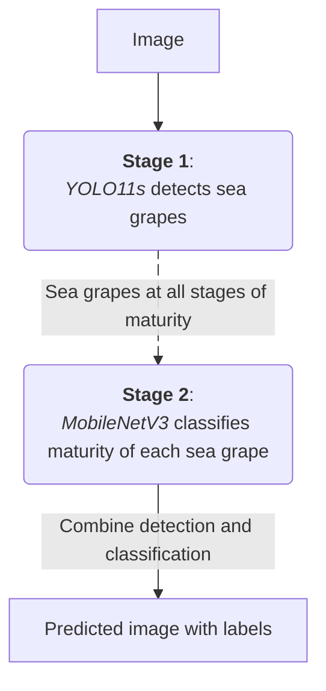

# Sea Grape Maturity Detection

### Example

Image             |  Model Detection
:-------------------------:|:-------------------------:
  |    

## Navigation
- [Project Workflow](#project-workflow)
- [Development](#development)
    - [0. Prepare Data](#0-prepare-data)
    - [1. Process Data](#1-process-data)
    - [2. Build Dataset for Classifier](#2-build-dataset-for-classifier)
    - [3. Train the Detector](#3-train-the-detector)
    - [4. Train the Classifier](#4-train-the-classifier)
    - [5. Detect & Classify Sea Grapes](#5-detect--classify-sea-grapes)
- [Results](#results)

## Project Workflow

## Development

### 0. Prepare Data

**⚠ Problems**: The original dataset is missing many sea grape labels, which can confuse the model into treating real sea grapes as background.

**🛠️ Method**: I trained a model on the original dataset and used it to pre-label the missing sea grapes, then manually reviewed and refined all annotations.

Original Data             |  Updated Data
:-------------------------:|:-------------------------:
 |    

---

### 1. Process Data 

> <a href="pipeline/01_slice_tiles.py" target="_blank">pipeline/01_slice_tiles.py</a>

**⚠ Problems**: 
- The dataset contains 4640x3480 images, which are quite big but blurry. 
- Resizing them directly to YOLO's standard 640x640 input would shrink each grape (~80x79 px) down to roughly 11 px, making harder to detect.

**🛠️ Method**: Each image is sliced into 640x640 tiles, matching YOLO's standard input size while preserving the grape's real pixel size.

---

### 2. Build Dataset for Classifier

> <a href="pipeline/02_make_crops.py" target="_blank">pipeline/02_make_crops.py</a>

**💡 Purpose**: Build a classifier dataset from YOLO dataset format.

**🛠️ Methods**:
1. Extract each bounding box (one crop) with expanded 15% padding on each side from YOLO dataset
    > 15% padding is to show the classifier the neighboring grapes because maturity judgement is partly relative to the neighbors.
2. Split all bounding boxes (crops) into train/test/valid folders. 

---

### 3. Train the Detector

> <a href="pipeline/03_train_detector.py" target="_blank">pipeline/03_train_detector.py</a>

**💡 Purpose**: Train a detector model to detect sea grapes at all stages of maturity.

**⚙️ Model**: YOLO11s — suitable model for our dataset size (few thousand tiles) and small object detection.

**🛠️ Method**: Call `model.train()` with augmentation parameters.

---

### 4. Train the Classifier

> <a href="pipeline/04_train_classifier.py" target="_blank">pipeline/04_train_classifier.py</a>

**💡 Purpose**: Train a classifier model to classify maturity of each sea grape

**⚙️ Model**: MobileNetV3-Small — a small and fast model to learn small dataset and remain fast classification.

**🛠️ Method**: 
1. Load dataset from [the building dataset step](#3-build-dataset-for-classifier)
2. Create `torchvision.transforms` for training and evaluating the model
3. Balance class weight using `WeightedRandomSampler()` 
    > This addresses imbalanced dataset as the Whitening sample size is 13 times smaller than the Harvestable one.
4. Train the model 
5. After each epoch, evaluate macro recall on the validation set and save the model only when it improves
    > Macro recall averages recall per class, so the rare Whitening class counts as much as Harvestable. Plain accuracy would reward a model that always guesses Harvestable.

---

### 5. Detect & Classify Sea Grapes

> <a href="pipeline/05_detect_classify.py" target="_blank">pipeline/05_detect_classify.py</a>

**💡 Purpose**: Detect and classify sea grapes by combining the two stages.

**🛠️ Methods**:
- Stage 1: `detect()`
    1. Slice input image into 640x640 tiles and stride 512px
        > Sliding window stride helps preventing the cut in half sea grapes.
    2. Create batches of 32 tiles and call `YOLO.predict()` for each
    3. Drop boxes that are likely the cut in half sea grapes in the batch
    4. Merges duplicated boxes from tile overlap
- Stage 2: `classify()`
    1. Load predicted boxes from Stage 1
    2. Expand each box by 15% padding and resize to 128x128
        > Following [the dataset structure](#3-build-dataset-for-classifier)
    3. Run the classifier model on all crops at once
- Combine results and output them

## Results

### All bounding boxes

| | Original | Updated | Model Prediction |
| :--- | :--- | :--- | :--- |
| Images | 46 | 46 | 46 |
| Grape boxes | 3,834 | 8,469 | 8,122 |
| Darkening | 838 | 1,505 | 1,191 |
| Harvestable | 2,625 | 6,464 | 6,021 |
| Whitening | 371 | 500 | 568 |
| Uncertain | — | — | 342 |

***Note: RedSlime*** *class was* ***excluded*** *due to an insufficient dataset.*

---

### Detection Metrices
**Against the original dataset:**

| IoU | Recall | Precision |
| :--- | :--- | :--- |
| 0.30 | 0.6351 | 0.2998 |
| 0.50 | 0.5636 | 0.2661 |
| 0.75 | 0.1664 | 0.0786 |

**Against the updated dataset:**

| IoU | Recall | Precision |
| :--- | :--- | :--- |
| 0.30 | 0.6931 | 0.7227 |
| 0.50 | 0.6840 | 0.7132 |
| 0.75 | 0.5179 | 0.5400 |

***Note:***  
*<u>IoU</u> measures the overlap between a predicted bounding box and the ground-truth bounding box.*
* *IoU = 0.3 means 30% overlapping*
* *IoU = 0.5 means 50% overlapping*
* *IoU = 0.75 means 75% overlapping*

*<u>Recall</u> measures how completely the model finds all real positive cases.*  
&emsp; *= matched / (matched + missed)*  
*<u>Precision</u> measures how reliable a positive guess is.*  
&emsp; *= matched / total detections*  
> *For example, **ground truth:** 135 grapes | **model found:** 285 boxes | **matched:** 97 boxes.*  
*Recall = 97 / 135 = 0.719*  
*Precision = 97 / 285 = 0.340*

---
This matrix below compares the count of sea grapes present across both datasets against those successfully detected by the model.

| Subset | Boxes | Found by detection | Recall |
| :--- | :--- | :--- | :--- |
| Already in the original | 1,088 | 662 | 0.6085 |
| Added by the update | 7,381 | 5,131 | 0.6952 |

---

Scored on detections matched at IoU 0.5, against the updated labels:

| Truth | Darkening | Harvestable | Whitening | Uncertain | Recall |
| :--- | :--- | :--- | :--- | :--- | :--- |
| Darkening | 679 | 24 | 0 | 25 | 0.933 |
| Harvestable | 65 | 4502 | 83 | 168 | 0.934 |
| Whitening | 0 | 2 | 241 | 4 | 0.976 |

Accuracy **0.9360**, macro recall **0.9476**, with 5,793 matched grapes.